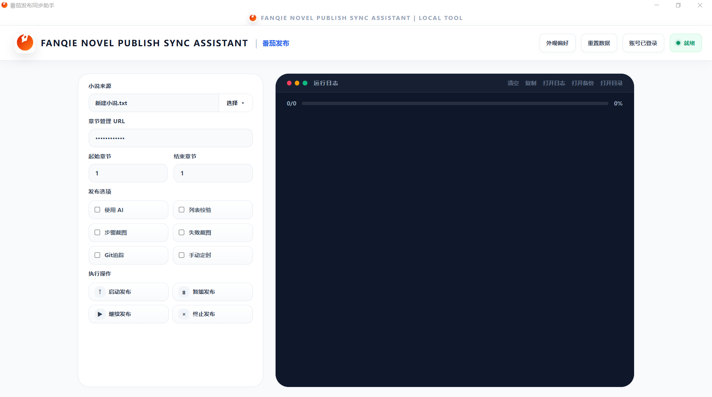

<div align="center">


<br />
<br />


</div>

---

<details>
<summary>Click here —— English Introduction</summary>

# FANQIE PUBLISH & SYNC ASSISTANT

## Fanqie Publish & Sync Assistant

<br />

<p>
<strong>Huh? You actually clicked in?</strong>
</p>

<p>
Alright then, let me say a few words.
</p>

<p>
This is a small local assistant made for web novel writers. Its main purpose is pretty simple: less copying and pasting, less manual checking, less repetitive clicking, and a little more time left for actually writing the story.
</p>

<p>
Because writing novels is already tiring enough. Who on earth wants to organize chapters, compare drafts, and click around all day? (￣▽￣)~*
</p>

---

## What can this thing do?

Simply put, it packs several common workflows into one local desktop tool:

```txt
FANQIE PUBLISH & SYNC ASSISTANT | Fanqie Publishing
FANQIE PUBLISH & SYNC ASSISTANT | Fanqie Syncing
FANQIE PUBLISH & SYNC ASSISTANT | Novel Processing
FANQIE PUBLISH & SYNC ASSISTANT | Web Crawling
FANQIE PUBLISH & SYNC ASSISTANT | Character Notes
FANQIE PUBLISH & SYNC ASSISTANT | Current Plot
```

More specifically:

* **Fanqie Publishing**: sends local chapters into the Fanqie writer backend. One less click is still one less click.
* **Fanqie Syncing**: compares local chapters with web chapters and catches differences when something does not match.
* **Novel Processing**: organizes TXT files, detects chapters, formats text, and splits novels by chapter, chapter count, file size, or line count.
* **Web Crawling**: fetches chapters, saves them as TXT, and cleans up the messy stuff along the way.
* **Character Notes**: organizes character notes and helps turn them into reusable prompt-ready notes.
* **Current Plot**: manages current-plot context files so the next chapter can stay aligned with what is happening now.

That is pretty much it.

It is not that I do not want to write a manual.
It is just that once you run it, you will probably figure out most of it.

```bash
python main.py
```

---

## Why did I make this?

Because when I was writing novels, I realized that some operations were genuinely annoying.

After finishing a chapter, I had to clean it up.
After cleaning it up, I had to publish it.
After publishing it, sometimes I would read it again on my phone and make a few changes, which meant the mobile/web version and my local draft were no longer the same...

And well, sometimes I also wanted to grab some web content. Hehe~

So I started wondering:

> Is there a chance my computer could handle some of this boring work for me?

And then this thing came out.

---

## Who is it for?

* web novel writers
* people who keep drafts in local TXT files
* people who often organize chapters
* people who often jump back and forth between the Fanqie backend and local drafts
* people who get a headache whenever they see repetitive clicking

If that sounds like you, then congrats, my friend.
You might actually find this useful.

---

## A small reminder

This is an unofficial local assistant.

Please use it properly.
Please follow the platform rules.
Please do not use it for weird stuff.

Writing is not easy, and a tool is still just a tool.
If you really want to get somewhere, you still have to sit down and write.

---

## Thanks

Thanks to [番茄小说全自动发文机器人](https://github.com/hchcx/fanqie_auto_publish) for the interface design reference. It made the whole project look much nicer.

</details>

---

# FANQIE PUBLISH & SYNC ASSISTANT

## 番茄发布与同步助手

<br />

<table width="100%">
  <tr>
    <td width="72%" valign="top">

<p>
<strong>诶？你居然点进来了？</strong>
</p>

<p>
那我就简单说两句。
</p>

<p>
这是一个给网文作者用的本地小助手。主要用途嘛，大概就是：少点复制粘贴，少点手动检查，少点重复点击，给自己留点时间写正文。
</p>

<p>
毕竟写小说已经够累了，谁家好人还天天手动整理章节、对比正文、点来点去啊？(￣▽￣)~*
</p>

</td>
<td width="28%" align="center" valign="top">


</td>
  </tr>
</table>

---

## 这玩意儿能干嘛？

简单来说，它把几个常用流程塞到了一个本地桌面工具里：

```txt
FANQIE PUBLISH & SYNC ASSISTANT | 番茄发布
FANQIE PUBLISH & SYNC ASSISTANT | 番茄同步
```

至于更具体一点点的？

* **番茄发布**：把本地章节送进番茄后台，少点一点是一点。
* **番茄同步**：本地和网页章节对一对，不一致就揪出来。

就这样。

至于更具体的？

emmm......

看看界面？



emmm......

还想要？

那雀食没有嘞~

不是我不想写说明书，主要是——

这东西一运行，基本就知道咋用了。

鹅且，现在有辣么多ai，问问就差不多知道嘞。

```bash
python main.py
```

---

## 为什么写这个？

因为我写小说的时候发现，有些操作是真的烦。

一章写完了，要整理。

整理完了，要发布。

发布完了，有时候还会在手机上阅读一番再改改，这样就和电脑端不一样了......

然后嘛，偶尔抓点网页内容，嘿嘿~

于是我寻思：

> 有没有一种可能，让电脑替我干点脏活累活？

然后它就出来了。

---

## 适合谁？

* 写网文的
* 用本地 TXT 存稿的
* 经常整理章节的
* 经常在番茄后台和本地稿子之间来回横跳的
* 看到重复点击就脑壳疼的

如果你也是这种人，那——
恭喜，我的盆友，你大概能用上它。

---

## 小提醒

这是非官方本地辅助工具。

请正常使用。
请遵守平台规则。
请不要拿它干奇奇怪怪的事。

写作不易，工具只是工具。
要想支棱起来，还得靠老老实实码字。

---

## 致谢

感谢 [番茄小说全自动发文机器人](https://github.com/hchcx/fanqie_auto_publish) 的界面设计，它让整个项目的外观看起来十分美观。

<div align="center">


</div>
